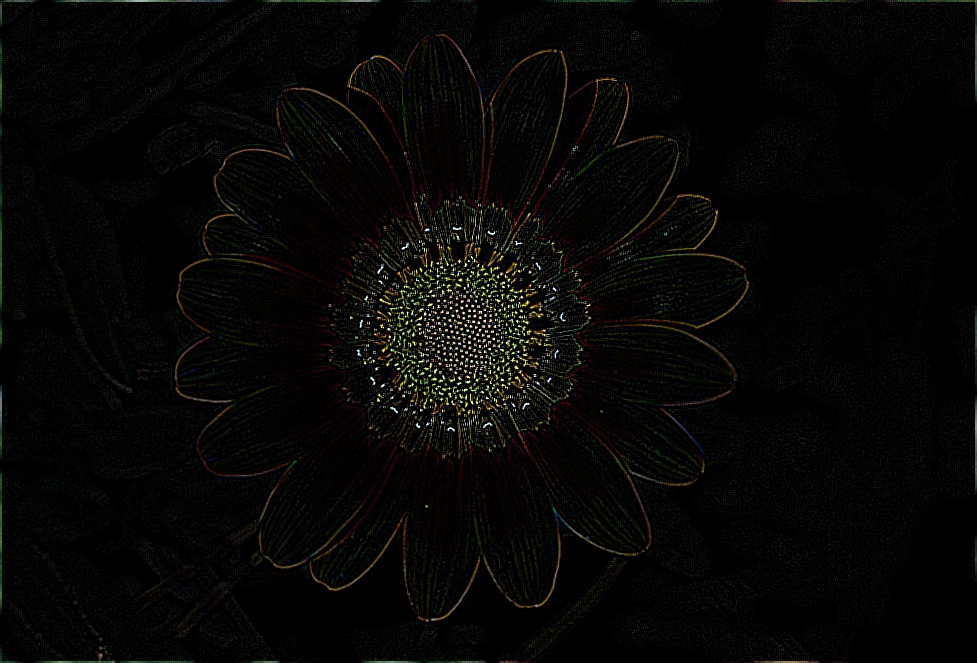

# Photographic-Filter
This code was written in C and applies a filter onto an image.ppm file based on the specified kernel.  
 
For example the kernel:  
-1 -1 -1  
-1  8 -1  
-1 -1 -1    
Produced a filter on the following image:  
 

 
  
Other output files are provided in the repository displaying different kernels resulting in different filters.
The example images were taken from the following websites:  
> https://www.britannica.com/science/ray-flower  
> https://www.theverge.com/2016/5/5/11592622/this-is-fine-meme-comic  

